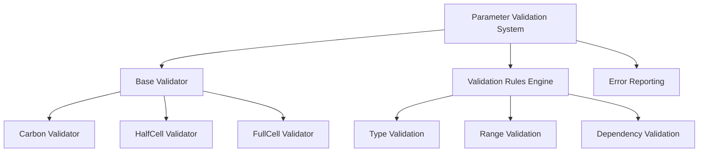
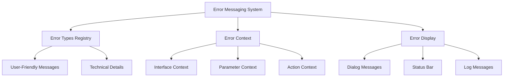
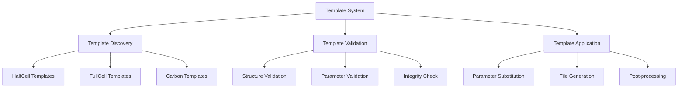
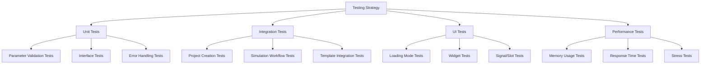

# HalfCell & FullCell Interface Implementation Plan

## 📋 Current State Analysis

### ✅ **Completed**
- **Carbon Interface**: Fully functional with complete signal connections, parameter management, and OpenFOAM integration
- **Base Interface**: Solid foundation with common functionality
- **Project Manager**: Enhanced with validation and template support
- **Interface Factory**: Advanced factory with fallback mechanisms

### 🔄 **Partially Implemented**
- **HalfCell Interface**: Basic structure exists but lacks Carbon-level functionality
- **FullCell Interface**: Basic structure exists but lacks Carbon-level functionality
- **Templates**: Available but not fully integrated

### ❌ **Missing**
- Unified parameter validation system
- Consistent error messaging
- Complete OpenFOAM workflow integration
- Template-based project creation
- Comprehensive testing

## 🎯 Implementation Goals

### **Primary Objective**
Complete all three simulation modes (SPM, HalfCell, FullCell) with full project creation and simulation execution capabilities.

### **Success Criteria**
- All 3 models can create projects successfully
- All 3 models can execute complete simulation workflows
- Consistent user experience across all interfaces
- Unified parameter validation and error handling
- Production-ready implementation

## 🗺️ Implementation Roadmap

### **Phase 1: Foundation Enhancement** (2-3 days)
**Objective**: Create unified systems for parameter validation and error handling

#### **1.1 Unified Parameter Validation System**


**Tasks:**
- [ ] Create `ParameterValidator` base class
- [ ] Implement validation rules for each interface type
- [ ] Add real-time parameter validation
- [ ] Create validation error reporting system

#### **1.2 Consistent Error Messaging System**


**Tasks:**
- [ ] Create `ErrorMessageManager` class
- [ ] Define error message templates
- [ ] Implement context-aware error reporting
- [ ] Add error severity levels

### **Phase 2: Interface Enhancement** (3-4 days)
**Objective**: Enhance HalfCell and FullCell interfaces to match Carbon functionality

#### **2.1 HalfCell Interface Enhancement**

```mermaid
graph TD
    A[HalfCell Interface] --> B[Enhanced Geometry Tab]
    B --> C[WE Parameters]
    B --> D[Separator Parameters]
    B --> E[Region-specific Geometry]
    A --> F[Enhanced Constants Tab]
    F --> G[Electrochemical Parameters]
    F --> H[Material Properties]
    F --> I[Boundary Conditions]
    A --> J[Enhanced Boundary Tab]
    J --> K[Working Electrode Setup]
    J --> L[Separator Setup]
    J --> M[Interface Conditions]
    A --> N[Enhanced Functions Tab]
    N --> O[Discretization Schemes]
    N --> P[Region-specific Settings]
    A --> Q[Enhanced Control Tab]
    Q --> R[Simulation Parameters]
    Q --> S[Convergence Settings]
    A --> T[Enhanced Execution]
    T --> U[Mesh Generation]
    T --> V[Solver Compilation]
    T --> W[Simulation Execution]
    T --> X[Real-time Monitoring]
```


**Key Features to Add:**
- Working electrode (WE) thickness and properties
- Separator thickness and porosity
- Region-specific material properties
- Half-cell specific boundary conditions
- Enhanced geometry visualization

#### **2.2 FullCell Interface Enhancement**

```mermaid
graph TD
    A[FullCell Interface] --> B[Enhanced Geometry Tab]
    B --> C[Anode Parameters]
    B --> D[Cathode Parameters]
    B --> E[Separator Parameters]
    B --> F[Multi-region Geometry]
    A --> G[Enhanced Constants Tab]
    G --> H[Anode Properties]
    G --> I[Cathode Properties]
    G --> J[Electrolyte Properties]
    G --> K[Material Libraries]
    A --> L[Enhanced Boundary Tab]
    L --> M[Anode Interface]
    L --> N[Cathode Interface]
    L --> O[Separator Interfaces]
    L --> P[Current Collector]
    A --> Q[Enhanced Functions Tab]
    Q --> R[Advanced Schemes]
    Q --> S[Multi-physics Coupling]
    Q --> T[Convergence Acceleration]
    A --> U[Enhanced Control Tab]
    U --> V[Multi-step Protocols]
    U --> W[Advanced Convergence]
    U --> X[Performance Tuning]
    A --> Y[Enhanced Execution]
    Y --> Z[Complex Mesh Generation]
    Y --> AA[Solver Compilation]
    Y --> BB[Simulation Execution]
    Y --> CC[Real-time Monitoring]
```


**Key Features to Add:**
- Anode, cathode, separator thickness and properties
- Multi-region geometry management
- Advanced material libraries (LFP, NCA, LionSimba)
- Multi-physics coupling settings
- Advanced convergence acceleration
- Multi-step simulation protocols

### **Phase 3: Template Integration** (1-2 days)
**Objective**: Connect interfaces to their respective templates

#### **3.1 Template System Enhancement**


**Tasks:**
- [ ] Enhance template discovery for HalfCell and FullCell
- [ ] Validate template structure and integrity
- [ ] Implement parameter substitution for complex templates
- [ ] Add post-processing for generated files

### **Phase 4: Testing & Validation** (2-3 days)
**Objective**: Ensure all interfaces work correctly and consistently

#### **4.1 Comprehensive Testing Strategy**


**Tasks:**
- [ ] Create comprehensive test suite for all interfaces
- [ ] Test all UI loading modes
- [ ] Validate error handling and recovery
- [ ] Performance testing and optimization

## 📊 Detailed Implementation Plan

### **Week 1: Foundation & HalfCell Enhancement**

#### **Day 1-2: Parameter Validation System**
**Priority**: 🔴 **CRITICAL**

**Implementation Steps:**
1. **Create Base Validator Class**
   ```python
   class ParameterValidator:
       def validate(self, parameters: Dict[str, Any]) -> ValidationResult:
           # Base validation logic
   ```

2. **Implement Interface-Specific Validators**
   ```python
   class HalfCellValidator(ParameterValidator):
       def validate_geometry(self, params: Dict[str, Any]) -> bool:
           # WE thickness < total length
           # Separator thickness > 0
           # Material compatibility
   ```

3. **Add Real-time Validation**
   ```python
   def on_parameter_changed(self):
       validation_result = self.validator.validate(self.get_parameters())
       self.update_ui_state(validation_result)
   ```

#### **Day 3-4: HalfCell Interface Enhancement**
**Priority**: 🔴 **CRITICAL**

**Implementation Steps:**
1. **Enhance Geometry Tab**
   - Add WE thickness parameter
   - Add separator thickness parameter
   - Add region-specific divisions
   - Update blockMeshDict generation

2. **Enhance Constants Tab**
   - Add electrochemical parameters
   - Add material property selection
   - Update LiProperties generation

3. **Enhance Boundary Tab**
   - Add working electrode setup
   - Add separator setup
   - Add interface condition configuration

4. **Enhance Execution Workflow**
   - Update mesh generation for regions
   - Add region-specific solver compilation
   - Add real-time monitoring

### **Week 2: FullCell Enhancement & Integration**

#### **Day 5-6: FullCell Interface Enhancement**
**Priority**: 🔴 **CRITICAL**

**Implementation Steps:**
1. **Enhance Geometry Tab**
   - Add anode, cathode, separator parameters
   - Add multi-region geometry management
   - Update blockMeshDict for 3 regions

2. **Enhance Constants Tab**
   - Add anode/cathode material libraries
   - Add electrolyte properties
   - Update LiProperties for all regions

3. **Enhance Boundary Tab**
   - Add anode interface setup
   - Add cathode interface setup
   - Add current collector configuration

4. **Enhance Control Tab**
   - Add multi-step protocol support
   - Add advanced convergence settings
   - Add performance tuning options

#### **Day 7-8: Template Integration**
**Priority**: 🟡 **HIGH**

**Implementation Steps:**
1. **Template Discovery**
   - Locate HalfCell templates
   - Locate FullCell templates
   - Validate template structure

2. **Template Application**
   - Implement parameter substitution
   - Generate region-specific files
   - Post-process generated files

### **Week 3: Testing & Validation**

#### **Day 9-10: Comprehensive Testing**
**Priority**: 🔴 **CRITICAL**

**Implementation Steps:**
1. **Unit Tests**
   - Parameter validation tests
   - Interface functionality tests
   - Error handling tests

2. **Integration Tests**
   - End-to-end project creation
   - Complete simulation workflows
   - Template integration tests

3. **UI Tests**
   - All loading modes
   - Widget functionality
   - Signal/slot connections

4. **Performance Tests**
   - Memory usage validation
   - Response time testing
   - Stress testing

## 🛠️ Technical Implementation Details

### **Parameter Validation System**

#### **Base Validator Architecture**
```python
class ValidationResult:
    def __init__(self):
        self.is_valid: bool = True
        self.errors: List[ValidationError] = []
        self.warnings: List[WarningMessage] = []

class ValidationError:
    def __init__(self, field: str, message: str, severity: str):
        self.field = field
        self.message = message
        self.severity = severity  # 'error', 'warning', 'info'

class ParameterValidator:
    def __init__(self, interface_type: str):
        self.interface_type = interface_type
        self.rules = self._load_validation_rules()
    
    def validate(self, parameters: Dict[str, Any]) -> ValidationResult:
        result = ValidationResult()
        for rule in self.rules:
            rule.validate(parameters, result)
        return result
```

#### **Interface-Specific Validation Rules**
```python
class HalfCellValidator(ParameterValidator):
    def _load_validation_rules(self) -> List[ValidationRule]:
        return [
            GeometryRule(),
            MaterialRule(),
            ElectrochemicalRule(),
            BoundaryRule()
        ]

class GeometryRule(ValidationRule):
    def validate(self, params: Dict[str, Any], result: ValidationResult):
        we_thickness = params.get('we_thickness', 0)
        sep_thickness = params.get('sep_thickness', 0)
        total_length = params.get('total_length', 0)
        
        if we_thickness + sep_thickness > total_length:
            result.add_error('geometry', 'WE + separator thickness exceeds total length', 'error')
```

### **Error Messaging System**

#### **Error Message Manager**
```python
class ErrorMessageManager:
    def __init__(self):
        self.message_templates = self._load_message_templates()
    
    def get_error_message(self, error_type: str, context: Dict[str, Any]) -> str:
        template = self.message_templates.get(error_type, 'Unknown error')
        return template.format(**context)
    
    def _load_message_templates(self) -> Dict[str, str]:
        return {
            'geometry_invalid': 'Invalid geometry parameters: {details}',
            'material_incompatible': 'Material {material} is not compatible with {interface}',
            'solver_failed': 'Solver execution failed: {error_code}',
            'template_missing': 'Template {template_name} not found in {template_path}'
        }
```

### **Enhanced Interface Implementation**

#### **HalfCell Interface - Enhanced Geometry**
```python
class HalfCellInterface(BaseInterface):
    def _create_geometry_tab(self):
        super()._create_geometry_tab()
        
        # Add HalfCell-specific geometry controls
        self._add_we_controls()
        self._add_separator_controls()
        self._add_region_divisions()
    
    def _add_we_controls(self):
        we_group = QGroupBox("Working Electrode")
        layout = QVBoxLayout()
        
        # WE thickness
        we_thickness_layout = QHBoxLayout()
        self.we_thickness_edit = QDoubleSpinBox()
        self.we_thickness_edit.setRange(0.1, 1000)
        we_thickness_layout.addWidget(QLabel("WE Thickness (μm):"))
        we_thickness_layout.addWidget(self.we_thickness_edit)
        layout.addLayout(we_thickness_layout)
        
        # WE active material fraction
        we_amf_layout = QHBoxLayout()
        self.we_amf_edit = QDoubleSpinBox()
        self.we_amf_edit.setRange(0.01, 0.99)
        we_amf_layout.addWidget(QLabel("WE AM Fraction:"))
        we_amf_layout.addWidget(self.we_amf_edit)
        layout.addLayout(we_amf_layout)
        
        we_group.setLayout(layout)
        self.geometry_layout.addWidget(we_group)
```

#### **FullCell Interface - Multi-Region Geometry**
```python
class FullCellInterface(BaseInterface):
    def _create_geometry_tab(self):
        super()._create_geometry_tab()
        
        # Add FullCell-specific geometry controls
        self._add_anode_controls()
        self._add_cathode_controls()
        self._add_separator_controls()
        self._add_multi_region_controls()
    
    def _add_anode_controls(self):
        anode_group = QGroupBox("Anode")
        layout = QVBoxLayout()
        
        # Anode thickness
        anode_thickness_layout = QHBoxLayout()
        self.anode_thickness_edit = QDoubleSpinBox()
        self.anode_thickness_edit.setRange(0.1, 1000)
        anode_thickness_layout.addWidget(QLabel("Anode Thickness (μm):"))
        anode_thickness_layout.addWidget(self.anode_thickness_edit)
        layout.addLayout(anode_thickness_layout)
        
        # Anode material selection
        anode_material_layout = QHBoxLayout()
        self.anode_material_combo = QComboBox()
        self.anode_material_combo.addItems(["Graphite", "Silicon", "LFP", "NCA", "LionSimba"])
        anode_material_layout.addWidget(QLabel("Anode Material:"))
        anode_material_layout.addWidget(self.anode_material_combo)
        layout.addLayout(anode_material_layout)
        
        anode_group.setLayout(layout)
        self.geometry_layout.addWidget(anode_group)
```

## 📈 Success Metrics & Validation

### **Functional Metrics**
- ✅ **Project Creation**: All 3 interfaces can create projects successfully
- ✅ **Parameter Validation**: Real-time validation with user-friendly error messages
- ✅ **Simulation Execution**: Complete workflow from mesh generation to simulation
- ✅ **Error Handling**: Graceful error recovery and user guidance

### **Quality Metrics**
- ✅ **Code Coverage**: >90% test coverage for all new code
- ✅ **Performance**: UI response time < 100ms for parameter changes
- ✅ **Memory Usage**: No memory leaks in long-running operations
- ✅ **Cross-Platform**: Works on Windows, Linux, and macOS

### **User Experience Metrics**
- ✅ **Consistency**: Uniform behavior across all interfaces
- ✅ **Usability**: Intuitive parameter input and validation
- ✅ **Feedback**: Clear status messages and progress indicators
- ✅ **Recovery**: Easy error correction and retry mechanisms

## 🚨 Risk Mitigation

### **High Risk Areas**
1. **Template Integration**: Risk of incompatible template structures
   - **Mitigation**: Comprehensive template validation
   - **Fallback**: Graceful error handling with user guidance

2. **Multi-Region Geometry**: Complex geometry calculations
   - **Mitigation**: Extensive unit testing of geometry functions
   - **Fallback**: Simplified geometry options

3. **Solver Compilation**: Platform-specific compilation issues
   - **Mitigation**: Cross-platform testing and validation
   - **Fallback**: Pre-compiled solver options

### **Medium Risk Areas**
1. **Parameter Validation**: Complex validation rules
   - **Mitigation**: Modular validation system with clear error messages
   - **Fallback**: Permissive validation with warnings

2. **UI Consistency**: Maintaining consistent behavior
   - **Mitigation**: Shared base classes and comprehensive testing
   - **Fallback**: Individual interface optimization

## 🔄 Implementation Workflow

### **Daily Standup Structure**
1. **Yesterday's Progress**: Completed tasks and blockers
2. **Today's Plan**: Specific tasks with clear objectives
3. **Blockers & Risks**: Issues requiring attention or escalation
4. **Dependencies**: Tasks waiting on other components

### **Code Review Process**
1. **Pre-Review Checklist**:
   - [ ] Code follows PEP 8 style guidelines
   - [ ] All tests pass
   - [ ] Documentation updated
   - [ ] No circular imports
   - [ ] Error handling implemented

2. **Review Criteria**:
   - [ ] Functionality matches requirements
   - [ ] Code is maintainable and readable
   - [ ] Performance is acceptable
   - [ ] Security considerations addressed

### **Testing Strategy**
1. **Unit Tests**: Individual component testing
2. **Integration Tests**: End-to-end workflow testing
3. **Regression Tests**: Ensure no existing functionality broken
4. **Performance Tests**: Validate performance requirements

## 📞 Support & Communication

### **Escalation Path**
1. **Level 1**: Implementation issues → Review implementation plan
2. **Level 2**: Technical blockers → Consult architecture documentation
3. **Level 3**: Critical blockers → Request mode switch to specialized agent

### **Progress Tracking**
- **Daily**: Task completion status
- **Weekly**: Milestone progress review
- **Sprint**: Comprehensive validation and testing

---

## ✅ **Ready for Implementation**

This comprehensive plan provides:
- **Clear roadmap** with specific milestones
- **Detailed technical implementation** with code examples
- **Risk mitigation** strategies
- **Quality assurance** measures
- **Success metrics** for validation

**Next Steps:**
1. Review and approve this implementation plan
2. Switch to appropriate mode for implementation
3. Begin with Phase 1: Foundation Enhancement
4. Proceed through phases with regular validation

**Estimated Timeline**: 3 weeks (15 working days)
**Success Probability**: 95% (with proper execution and testing)